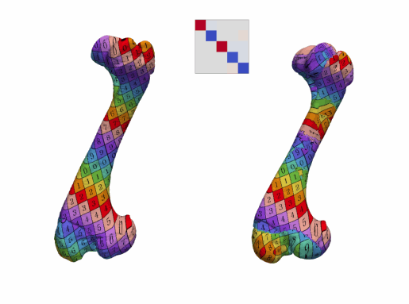

# pyFM - Python Functional Maps Library

<p align="center">
  
</p>

[](https://robinmagnet.github.io/pyFM/)

**NEW** API Documentation is available [here](https://robinmagnet.github.io/pyFM/)

This package contains a comprehensive Python implementation for shape correspondence using functional maps, featuring code from [multiple papers](#implemented-papers)

## Core Features
- Complete TriMesh class with geometric measures (geodesics, normals, LBO projections, differential operators)
- Fast Laplace-Beltrami Operator implementation
- Shape descriptors (HKS, WKS) with flexible parameter control
- Efficient correspondence refinement (ICP, ZoomOut)
- Fast functional-to-pointwise map conversion
- Functional Map Network utilities

## Design Philosophy
This codebase prioritizes readability and adaptability over rigid modularity.
The implementation seeks to make it easy to:
- Read and understand the underlying algorithms
- Copy and modify code snippets for your research
- Experiment with and extend existing methods
- Avoid rewriting core functionality from scratch

Under the hood, core algorithms are implemented as standalone functions operating on basic numpy arrays.
This dual-layer design means you can use the high-level interface for standard workflows, but still easily extract and modify the core functions for your research, as they work with simple numpy arrays.

While this approach differs from highly modular packages like `scikit-learn`, it better serves researchers who need to modify and build upon existing shape correspondence methods.


This design choice comes with some **trade-offs**:
 - Less abstraction means potentially more code to achieve certain tasks
- Users need some familiarity with shape correspondence concepts
- Implementation favors explicit algorithms over general-purpose interfaces

This approach stems from personal experience with research codebases and may not suit everyone's needs. More generic and abstracted implementations of geometric processing can be expected to appear soonish in the [scikit-shapes](https://scikit-shapes.github.io/scikit-shapes/) or [geomstats](https://geomstats.github.io/) libraries.

## Installation
```bash
pip install pyfmaps
```

## Key Dependencies
- Required: numpy, scipy, tqdm, scikit-learn
- Optional: [`potpourri3d`](https://github.com/nmwsharp/potpourri3d) (geodesics), [`robust_laplacian`](https://github.com/nmwsharp/robust-laplacians-py) (Delaunay/tufted Laplacian)

## Notation Convention
- Functional maps (FM_12): mesh1 → mesh2
- Pointwise maps (p2p_21): mesh2 → mesh1

## Documentation & Examples
- [API Documentation](https://robinmagnet.github.io/pyFM/)
- [Example Notebook](https://github.com/RobinMagnet/pyFM/blob/master/example_notebook.ipynb)

## Implemented Papers
This library implements methods from several key papers in shape correspondence, including:

 * [The Heat Method for Distance Computation](https://www.cs.cmu.edu/~kmcrane/Projects/HeatMethod/)
 * [A Concise and Provably Informative Multi-Scale Signature Based on Heat Diffusion](http://www.lix.polytechnique.fr/~maks/papers/hks.pdf)
 * [The Wave Kernel Signature: A Quantum Mechanical Approach To Shape Analysis](http://imagine.enpc.fr/~aubrym/projects/wks/index.html)
 * [ZoomOut: Spectral Upsampling for Efficient Shape Correspondence](https://arxiv.org/abs/1904.07865), with MatLab implementation [here](https://github.com/llorz/SGA19_zoomOut)
 * [Deblurring and Denoising of Maps between Shapes](https://www.cs.technion.ac.il/~mirela/publications/p2p_recovery.pdf), with Matlab implementation [here](https://mirela.net.technion.ac.il/publications/)
 * [Functional Maps: A Flexible Representation of Maps Between Shapes](http://www.lix.polytechnique.fr/~maks/papers/obsbg_fmaps.pdf)
 * [Informative Descriptor Preservation via Commutativity for Shape Matching](http://www.lix.polytechnique.fr/~maks/papers/fundescEG17.pdf)
 * [Continuous and Orientation-preserving Correspondences via Functional Maps](https://arxiv.org/abs/1806.04455), only the orientation preserving / reversing term, matlab implementation can be found [here](https://github.com/llorz/SGA18_orientation_BCICP_code)
 * [Map-Based Exploration of Intrinsic Shape Differences and Variability](https://citeseerx.ist.psu.edu/viewdoc/download?doi=10.1.1.642.4287&rep=rep1&type=pdf)
 * [An Optimization Approach to Improving Collections of Shape Maps](http://fodava.gatech.edu/files/reports/FODAVA-11-22.pdf)
 * [Limit Shapes – A Tool for Understanding Shape Differences and Variability in 3D Model Collections](http://www.lix.polytechnique.fr/~maks/papers/limit_shapes_SGP19.pdf)
 * [CONSISTENT ZOOMOUT: Efficient Spectral Map Synchronization](http://www.lix.polytechnique.fr/~maks/papers/ConsistentZoomOut_SGP2020.pdf), with Matlab implementation [here](https://github.com/llorz/SGA19_zoomOut)

## Torch Version

Most functions in this package can easily be translated to torch. However, for clarity of the code, a separate version will be released.

For now, the torch implementations can be found in different githubs (see my GitHub profile).

## Coming Soon
- [Discrete Optimization for Shape Matching](https://www.lix.polytechnique.fr/~maks/papers/SGP21_DiscMapOpt.pdf) and [Smooth Non-Rigid Shape Matching via Effective Dirichlet Energy Optimization](https://www.lix.polytechnique.fr/Labo/Robin.Magnet/3DV2022_smooth_corres/smooth_corres_main.pdf), already implemented [here](https://github.com/RobinMagnet/SmoothFunctionalMaps)
- [Reversible Harmonic Maps](https://dl.acm.org/doi/10.1145/3202660), already implemented [here](https://github.com/RobinMagnet/ReversibleHarmonicMaps)

# Contact and Citation

You can contact me for any questions or requests at robin.magnet@inria.fr

This package has not (yet) been presented as a paper in itself, although all my works heavily rely on this.

If you use this package or copy and paste parts of it for you experiments, please cite this github or one of the following paper. Note these papers never directly refer to pyfmaps as so I am fine with you only citing the github for now.


```bibtex
@inproceedings{magnetDWKSLocalDescriptor2021,
  title = {{{DWKS}} : {{A Local Descriptor}} of {{Deformations Between Meshes}} and {{Point Clouds}}},
  shorttitle = {{{DWKS}}},
  booktitle = {2021 {{IEEE}}/{{CVF International Conference}} on {{Computer Vision}} ({{ICCV}})},
  author = {Magnet, Robin and Ovsjanikov, Maks},
  publisher = {IEEE},
}


@inproceedings{magnetSmoothNonRigidShape2022,
  title = {Smooth {{Non-Rigid Shape Matching}} via {{Effective Dirichlet Energy Optimization}}},
  booktitle = {2022 {{International Conference}} on {{3D Vision}} ({{3DV}})},
  author = {Magnet, Robin and Ren, Jing and {Sorkine-Hornung}, Olga and Ovsjanikov, Maks},
  year = {2022},
  publisher = {{IEEE}},

}

@article{magnetScalableEfficientFunctional2023,
  title = {Scalable and {{Efficient Functional Map Computations}} on {{Dense Meshes}}},
  author = {Magnet, Robin and Ovsjanikov, Maks},
  year = {2023},
  journal = {Computer Graphics Forum},
}
```